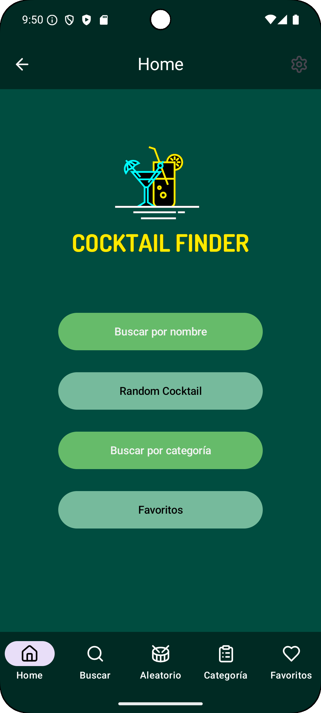
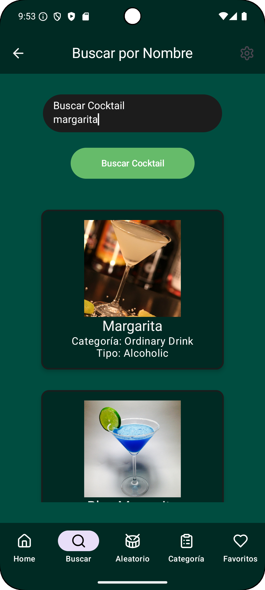
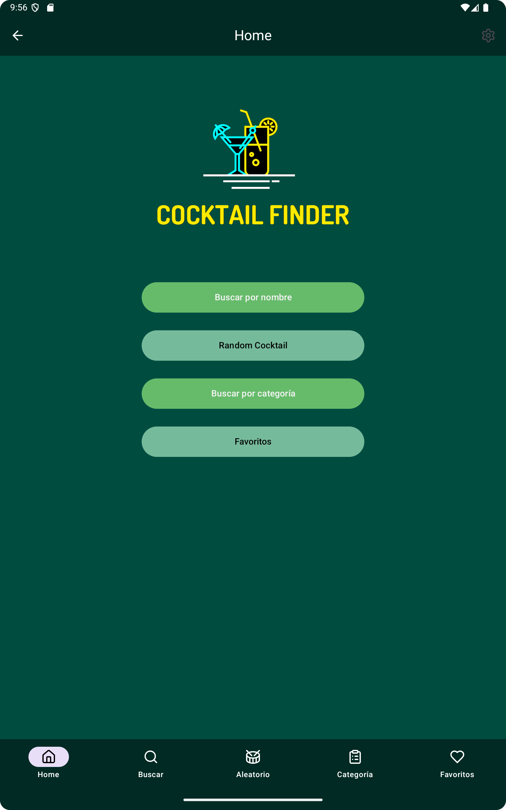
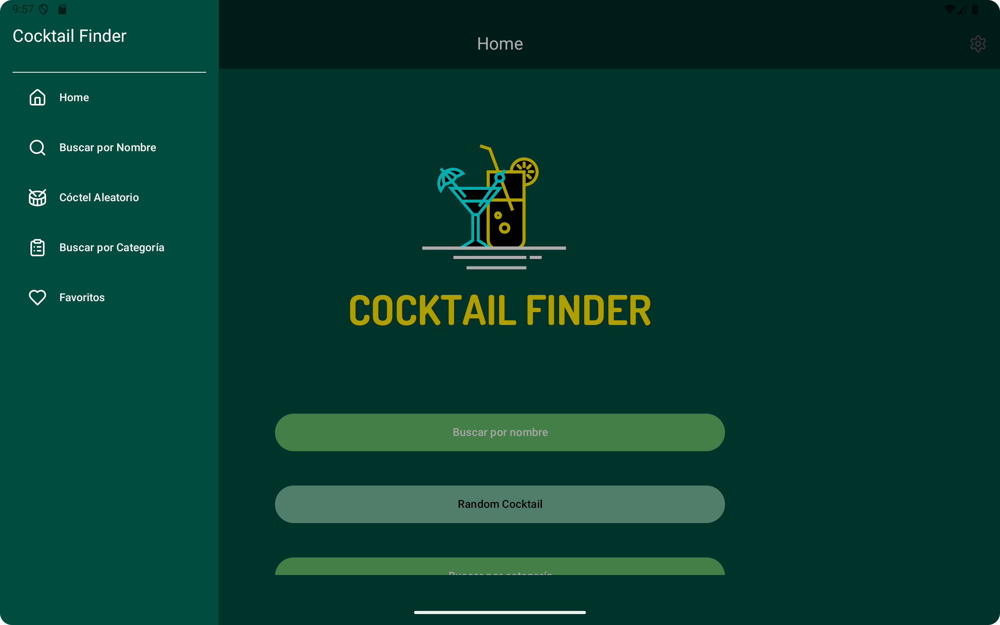

# 🍸 Cocktail Finder 🍹

¡Bienvenido a **Cocktail Finder**!  
Una aplicación interactiva que te permite explorar y descubrir cócteles de todo el mundo.  
Busca tus bebidas favoritas, explora categorías, encuentra cócteles aleatorios y guarda los que más te gusten en tu lista de favoritos.  

 

---

## 📌 **Descripción del Proyecto**

**Cocktail Finder** es una aplicación móvil desarrollada en **Kotlin** con **Jetpack Compose**, que permite a los usuarios buscar cócteles por nombre, explorar categorías de bebidas, obtener un cóctel aleatorio y administrar una lista de favoritos.  
Utiliza **TheCocktailDB API** para obtener información detallada sobre los cócteles.

 

---

## 🏛 **Estructura del Proyecto**

La aplicación sigue el patrón de arquitectura **MVVM (Model-View-ViewModel)**, lo que facilita la separación de lógica, datos y UI.

 ### **🧩 Módulo Model (Datos)**
 **`Drink.kt`** → Modelo de datos que representa un cóctel obtenido de la API. 
 **`DrinkEntity.kt`** → Modelo de datos para almacenar cócteles en la base de datos local (Room). 
 **`DataAPI.kt`** → Modelo que representa la estructura de la respuesta de la API. 
 **`Routes.kt`** → Define las rutas de navegación dentro de la aplicación 
 **`BottomNavItem.kt`** → Define los elementos de la barra de navegación inferior.  

 ### **📡 Módulo ViewModel (Lógica)**
 **`APIViewModel.kt`** → Maneja las solicitudes a la API y la gestión del estado de la interfaz de usuario. 
 **`CocktailViewModel.kt`** → Administra la lógica del juego, el almacenamiento local y las interacciones del usuario.  

 ### **🎨 Módulo View (Interfaz de Usuario)**
 **`AppCocktailNavigation.kt`** → Gestiona la navegación principal de la aplicación. 
 **`LaunchScreen.kt`** → Pantalla de bienvenida con animación del logo. 
 **`MainViewScreen.kt`** → Pantalla principal con opciones de búsqueda y exploración. 
 **`SearchByNameScreen.kt`** → Pantalla que permite buscar cócteles por nombre. 
 **`SearchByCategoryScreen.kt`** → Pantalla que muestra cócteles organizados por categoría. 
 **`CocktailRandomScreen.kt`** → Pantalla donde se muestra un cóctel aleatorio. 
 **`FavoritesScreen.kt`** → Pantalla para administrar cócteles favoritos. 
 **`DetailsScreen.kt`** → Pantalla de detalles con información completa de un cóctel.  
 
 ### **💾 Módulo Room (Base de Datos Local)**
 **`DrinkDao.kt`** → Interfaz DAO para la gestión de datos de cócteles en la base de datos Room. 
 **`DrinkDatabase.kt`** → Base de datos Room para almacenar información de los cócteles. 
 **`DrinkRepository.kt`** →  Capa de abstracción entre la base de datos y la UI. 
 **`DrinkApplication.kt`** → Configura la instancia de Room Database al iniciar la aplicación.  

 ### **🌐 Módulo API (Conexión con TheCocktailDB)**
 **`APIInterface.kt`** → Define los métodos de la API con Retrofit. 
 **`APIViewModel.kt`** → Maneja las solicitudes HTTP y actualiza la UI con los datos recibidos.  

 

---

### 🎮 Muestra del la App 🎮

<table align="center">
  <tr>
    <td align="center">
      
      
Móvil

    </td>
    <td width="100"></td> <!-- Celda vacía para espacio -->
    <td align="center">
      
      
Móvil

    </td>
  </tr>
</table>

<table align="center">
  <tr>
    <td align="center">
      
      
Tablet

    </td>
    <td width="100"></td> <!-- Celda vacía para espacio -->
    <td align="center">
      
      
Tablet

    </td>
  </tr>
</table>

### 🛠️ Tecnologías y Herramientas 🛠️

 

  

 

---

 

### Integrantes del equipo: 

  Alberto Rodellar,
  Leandro Struni 

<table align="center">
  <tr>
    <td>
      <table align="center">
        <tr>
          <td align="center">
            
          </td>
        </tr>
        <tr>
          <td>
            
          </td>
        </tr>
      </table>
    </td>
    <td>
      <table align="center">
        <tr>
          <td align="center">
            
          </td>
        </tr>
        <tr>
          <td>
            
          </td>
        </tr>
      </table>
    </td>
  </tr>
</table>

